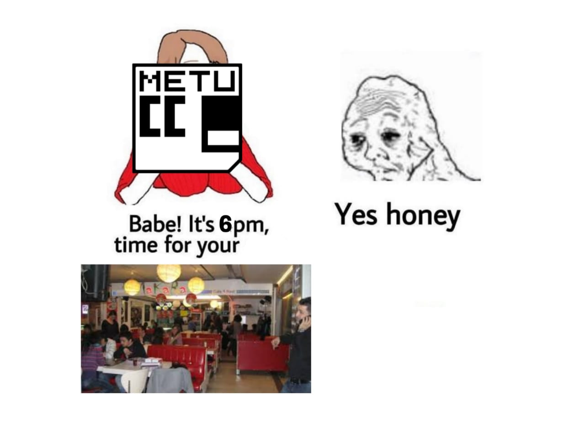

<h1>
Haftalık Toplantı - 10
<h3>31.03.2022 Perşembe 18.00</h3>
</h1>

### Logu Tutanlar:

- Elif Aslıcan Dişören
- Mehmet Karaman

### Logu Düzenleyen:

- Burak Metehan Tunçel

___

### Gündem Maddeleri:

- Haftalık Toplantı Gün ve Saati
- Haftalık Toplantı Sonrası Yemekler
- Polarlar (Yeniler ve Eskiler)
- Bu dönem neler var?
    - Programlama Yarışması (PY)
    - Bilişim Günü (BG)
- Soru-Cevap ve Öneri

___

> İkinci dönemin ilk logu ile karşınızdayız efenim. Öncelikle Aslıcan ve Mehmet'e teşekkür etmek lazım. 
> Bunun yanında en baştan uyarılarımızı yapalım: Logun bazı kısımlarında başta yazım hataları olmak üzere bazı hatalar olabilir. Eğer bu hatalar çok büyük değilse lütfen mazur görelim. 
> Şimdi sizleri logla baş başa bırakıyorum, iyi okumalar 🤗

**Berfinnur:** Dönemin ilk haftalık toplantısına hoşgeldiniz. 

<h2>Gündem[0] = Haftalık Toplantı Gün ve Saati</h2>

**Berfinnur:** Anketten perşembe çıktı ama çok düzgün çıkmadı. Haftanın günleri herkese uygun değil maalesef, her gün başka bir çakışma var. Birinci sınıfların BA100 dersi ve ikinci sınıfların haftalık quizlerini de düşündüğümüzde bir değişikliğe gidilebilir.

YK ile düşündük ki, çarşamba 18.30'da BA100 sonrası yapabiliriz. Size uygun mudur? Perşembe 18.15'te de bir boşluk var. 

<h6>Haftalık programların detayları ve konu üzerine konuşulup tartışılıyor.</h6>

Tartışma sonucunda yeni bir anketin yapılmasına kararlaştırıldı. Yeni anket en kısa sürede duyuru gruplarına atılacak. 

Ankette yer alacak seçenekler:

- Çarşamba 18.30
- Perşembe 18.00
- Perşembe 18.15

<h2>Gündem[1] = Haftalık Toplantı Sonrası Yemekler</h2>

**Berfinnur:** Haftalık toplantı sonrası yemek yemeye hep Makara'ya gidiliyor diye şakalar yapılıyordu. Yeni yerlerde mi yemek yesek konusu açıldı. Okulda nerelerde yiyebiliriz diye araştırdık ve yeni yerlerle görüştük. Şu an burada yeni önerisi olanlar var mıdır?

Konuşmalar sonucunda YK'nın ve insanların önerileri:

- Makara: En "*convenient*" seçenek, tercih edilesi yönleri baskın
- EBİ2 Kantini: Biz bekliyoruz, karşı taraf sipariş hazırlamakta zorlanıyor, uğultulu basık bir ortam, düşünmeyi bıraktık
- 7\. Yurt Kantini: **Haftaya gidilecek**
- 5\. Yurt Kantini: Masalar ve sandalyeler 4 kişilik ve sabit
- Çarşı Central: Rezervasyon yaptırılamıyor.
- İsa Demiray Kantini: Yiyecek opsiyonunu sormak gerek
- Güzel havalarda dışarıdan söyleyip Devrim'de yemek: Meh, biraz karmaşık olabilir.

**Gizem:** Sıra sıra deneyebiliriz.  
**Ozan:** Makara ile chicken run ortak, menünün çeşitliliği çok.  
**..:** Yedinci yurdun hambugeri çok güzel.  
**Berfinnur:** Vegan yemeklerin de olması önemli.  
**Bora:** Dışarıdan toplantı sonrası yemek sipariş edip açıkta yiyebiliriz (ilerisi için bir plan)  

<h6>Seçenekler üzerine konuşuluyor ve seçenekler değerlendiriliyor.</h6>

Konuşmalar, fikirler ve değerlendirmeler sonucu 7. yurda gideceğine karar verildi.

<h2>Gündem[2] = Polarlar (Yeniler ve Eskiler)</h2>

**Berfinnur:** Bu dönem polar siparişi verip odadan almayan kimler var? (Birkaç kişi el kaldıyor)

Polarlarınızı mümkün mertebe çabuk alın çünkü almazsanız nisanın birinci ya da ikinci haftasının sonuna kadar polarları odada tutacağız, devamında polar almak isteyip sipariş sürecini kaçırmış olanlar odada kalan polarları satın alabilir. Polarınız odadaysa yakın zamanda gelip almanızı öneriyoruz.

Buna ek olarak, geçen yıllardan fermuarsız siyah ve mavi olacak şekilde large-medium-small-xsmall bedenlerinde polarlar var, tanesi 100 tl, ilgilenenler gelip bakabilir.

<h2>Gündem[3] = Bu Dönem Neler Var?</h2>

**Berfinnur:** Bu dönem iki büyük etkinliğimiz var: PY ve BG.

#### Programlama Yarışması (PY)

**Berfinnur:** Programlama Yarışması nedir duymayan var mı? (yokmuş.) 

Soru yazma sürecine girdik, işin arkaplanına dahil olmak isteyeniniz varsa, teknik bilgi içermeyen yardımlar da dahil, bana toplantıdan sonra mesaj atabilirsiniz, yardımlara açığız.

#### Bilişim Günü (BG)

**Berfinnur:** BG nedir bilmeyen var mı? (Birkaç kişi el kaldırınca açıklanır): Bilişim günü bilgisayar topluluğunun düzenlediği bir salon etkinliği. Bir yandan konuşmacılar konuşmalarını yaparken, diğer yandan sponsorlar fuaye alanında stand açarak öğrencilerle buluşuyor. En son 2019'da yapıldı, uzun bir aradan sonra yeniden yapılacak, tarihi 21 Mayıs Cumartesi. Konuşmacı öneriniz var mıdır?

**Utkan:** Bilkent'ten Erdal Arıkan.  
**Yiğithan:** Chris Stephenson hocayı çağırabiliriz.  
**Utkan:** Elif Uysal, alanı age of information.  
**Yiğithan:** Ahmet Çevik, matematik felsefesiyle uğraşan ve cs hakkında bilim konuşması yapabilecek biri (Yusuf bu fikri beğendi).  
**Ozan:** Bendeki liste uzun.  
**Ersel:** Ali Doğan Aksoy (ODTÜ'de kriptolojiyle uğraşan matematikçi).  
**Ahmet:** Göktürk hoca olabilir.  
**Cansu:** Ercüment Çiçek. Bilkentte biyolojiyle cs arası ilginç işleri var.  
**Yiğithan:** Generative Arts birey.  
**Yusuf:** Onur Mutlu, erişilebilir, bilkente de geliyor, hardware konusunda özelleşmiş.  
**Bora:** Erkut/Aykut Erdem, hacettepe yapay zeka bölümü kurucuları.

#### Öneriler:

- Erdal Arıkan
- Chris Stephenson
- Elif Uysal
- Ahmet Çevik
- Ali Doğan Aksoy
- Göktürk Üçoluk
- Ercüment Çiçek
- Onur Mutlu
- Erkut/Aykut Erdem

<h2>Gündem[4] = Soru-Cevap ve Öneri</h2>

**..:** Bilişim günlerinin seneye özel teması oluyor mu?  
**Berfinnur:** Direkt olarak bir konsept düşünmedik, son BG'de konular biraz nişti.  
**Ozan:** Evet, konuları dengelemek gerek.  

**Berkay:** Geçen hafta workshop yaptık competitive ile ilgili, bir önerim var, her hafta codeforces yarışmaları yapılıyor örneğin, bir araya gelip her hafta çözdüklerimizi tartışsak güzel olabilir (pozitif tepkiler, konuşulması kararlaştırılıyor).  

**Yiğithan:** İlk codenight tarihi ne zaman? Uygun bir zaman dilimindeyiz.   
(Codenightin daha sık olması isteniyor, Berfinnur mümkün olamayışının sebebini açıklıyor, uygun tarih denenmeye çalışılacak)

**Ahmet:** Paintball yapılabilir?  
**Berfinnur:** Bu tür etkinlikleri, random whatsapp grubunda örneğin, kendiniz organize edebilirsiniz.  

____

**Berfinnur:** Toplantı sonuna geldik, geldiğiniz için teşekkürler! Yemeğe gidecekler bölümün önünde toplanıyoruz, hoşça kalın.

<h1>THE END</h1>
